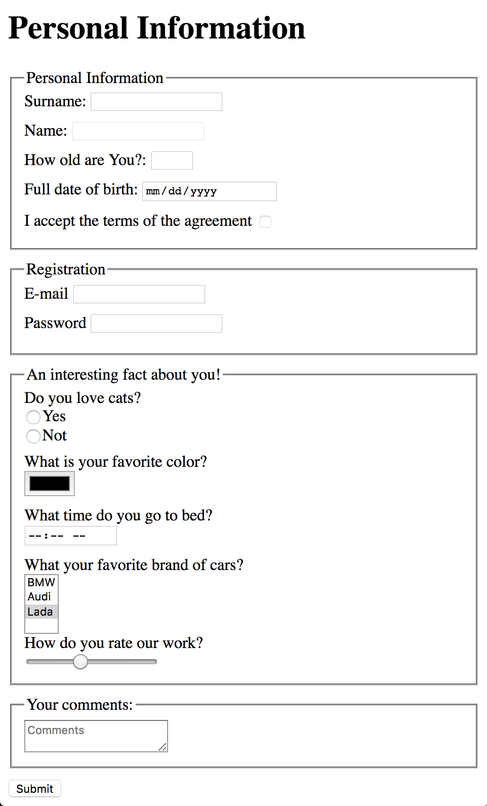

# Frontend practice with html forms

## Main goal:
Create HTML page with form. On form submit send form data to `https://mate-academy-form-lesson.herokuapp.com/create-application`.

The basic implementation of this form you can find [here](https://mate-academy-form-lesson.herokuapp.com)

Screenshot of this form:

### Stretch goal:
Send data with AJAX instead of standard form submission. When trying to achieve this, you'll learn what's [CORS](https://www.html5rocks.com/en/tutorials/cors/). Learn how to workaround it. Try to find a working solution.

## Common mistakes
* Validate your html with https://validator.w3.org/
* Every field should have name attribute
* Every field should have label, which focuses input on label click
* Do not use tabs. Use 2 spaces for indentation
* Most of the time you want each tag in new line

## Requirements:

Form should have different inputs with such types:
  - text
  - number
  - email
  - checkbox
  - radio
  - password
  - range
  - time
  - color
  - date

Also form should has textarea ans select elements.
  
Every field should has label which focus the input by click.
Every field should has name attribute.
  
You should use every of this attribute at least one time - required, min, max, minlength, maxlength, etc
At least one field should have default value.
At least one field should have placeholder value.
At least one field should has disabled autocomplete.

The final solution should be hosted on Github Pages and should show Success page after submit.

## How this app is working

Simple request/response nodejs app with Pug and Express. The app hosted in [heroku](https://mate-academy-form-lesson.herokuapp.com)

How to run:
 -  install heroku
 - `npm i`
 - `heroku local web`

Full guide: https://devcenter.heroku.com/articles/getting-started-with-nodejs

To push changes on production do `git push heroku master`
